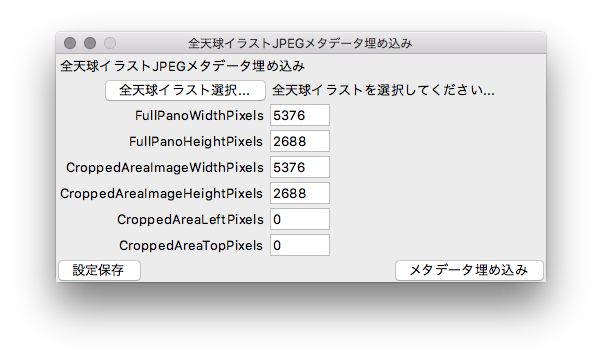

# convert_jpg_eqrect
正距円筒図法(Equirectangular)で描いたイラスト(JPEG画像)にPhoto Sphere XMPメタデータを挿入します

---
## 概要
JPEGファイルのヘッダー内(APP1)に全天球情報(Photo Sphere XMP)を埋め込みます。これによって、正距円筒図法(Equirectangular)に則って描かれたイラストは、360°再生対応サービスでVRモード(全天球)再生するようになります。([参考記事](https://qiita.com/mana_544/items/3245ce87f0a0fca80c2a))

## 動作環境(使用モジュール)
* Python(Anaconda) 3.6.4(5.1.0)
* tkinter 8.6

## 使い方
"convert_jpg_eqrect.py"を呼び出すと、
以下のようなGUI設定画面が立ち上がります。  

「全天球イラスト選択...」ボタンを押下し、
JPEGフォーマットで書きだした全天球イラストを選択します。  
つづいて、以下の設定値を入力します。

| 名前 | format|初期値|
|:---|:---|:---|
|FullPanoWidthPixels|int|5376|
|FullPanoHeightPixels|int|2688|
|CroppedAreaImageWidthPixels|int|5376|
|CroppedAreaImageHeightPixels|int|2688|
|CroppedAreaLeftPixels|int|0|
|CroppedAreaTopPixels|int|0|

各設定値の意味については、
[Photo Sphere XMP メタデータ](https://developers.google.com/streetview/spherical-metadata?hl=ja)
を参照して下さい。

## メタデータ埋め込み
設定値を入力したら「メタデータ埋め込み」ボタンを押下すると、
JPEGヘッダ内に上記設定値の全天球情報(Photo Sphere XMP)を埋め込みます。
埋め込む位置は、元から存在するAPP0(JFIF)もしくはAPP1(Exif)の直後に埋め込みます。  
Exif以外のAPP1(xmp)セグメントが元々埋め込まれている場合は、その情報は破棄します。  
全天球情報を埋め込んだ画像は、入力画像と同じフォルダに
「Equirectangular XMP」を付加したファイル名で新規にJPEGファイルを生成します。

## 設定値の保存
「設定保存」ボタンを押下すると、現在の設定値を保存することができます。
保存した設定値はGUI(設定画面)を閉じても保持され、次回起動時に自動的にロード・反映されます。  
設定値は「setting.json」に記録しています。設定値を初期化したい場合は、このリポジトリの「setting.json」を、ご自身のワーキングツリーに対して`fetch`した後に`checkout`すれば初期値にリセットされます。(別にローカルリポジトリ全体を`reset`してもいいけど)

## 免責事項
このプログラムはそもそも展開用に書いたものではないので、ドキュメント等はありません(書く予定もありません)。従って、備忘録的に書いたソース内のコメントを頼りに、Pythonコードを解析できる人のみ利用してください。  
ライセンスはGPLに準拠します。利用の際は、作者は一切の責任(サポート等)を負わないものとします。  
もともと作者(わたなべ:mana544)が全天球イラスト制作用に個人的に描いた汎用性のないスクリプトなので、ソース(構造含む)が汚いのはご容赦を。合間見てちょぼちょぼ修正入れていきます。Fork大歓迎(誰か抽象化してクラスで書いてくれないかな…)

